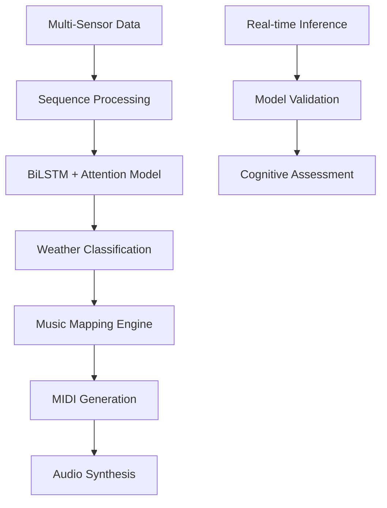

# 🌳 Naadvriksha: Connect human to Nature

[](https://python.org)
[](https://tensorflow.org)
[]()

> **Naadvriksha** (*Sanskrit: नादवृक्ष - "Sound Tree"*) is a project that includes advanced generative music creation, transforming environmental sensor data into harmonious musical compositions through deep learning. These generated midi music are then used to enchance user capabilities while performing task. 

## Project Overview

Naadvriksha represents a novel intersection of environmental monitoring, artificial intelligence, creative arts to connect one with it. The system employs utilizes bidirectional LSTM architecture with custom attention mechanisms to classify weather patterns from multi-sensor data (temperature, humidity, accelerometer, gyroscope, and light sensors), subsequently translating these classifications into contextually appropriate musical compositions.

### 🏗️ System Architecture



## Deep Learning Architecture

### Model Composition
The core neural network implements a **multi-layered bidirectional LSTM architecture** with custom attention mechanisms:

#### **Network Topology:**
- **Input Layer**: Sequential data (`sequence_length=20`, `feature_dim=9`)
- **Regularization**: Initial dropout (0.2) with Gaussian noise injection (σ=0.01)
- **BiLSTM Layer 1**: 32 units, L1/L2 regularization (λ=0.01), dropout (0.3)
- **BiLSTM Layer 2**: 24 units, enhanced regularization, dropout (0.4-0.5)
- **Custom Attention**: Query-Key-Value mechanism with residual connections
- **Global Average Pooling**: Temporal feature aggregation
- **Dense Layers**: Progressive dimensionality reduction (32→16→4)
- **Output**: Softmax classification for 4 weather classes

#### **Mathematical Foundation:**

The attention mechanism implements:
```
Query = tanh(W_q · X + b_q)
Key = tanh(W_k · X + b_k)  
Value = tanh(W_v · X + b_v)

Attention_scores = softmax(Query ⊗ Key^T)
Output = Attention_scores ⊗ Value + X  // Residual connection
```

### **Training Configuration:**
- **Optimizer**: Adam (lr=0.0001, clipnorm=1.0)
- **Loss Function**: Sparse categorical crossentropy
- **Class Balancing**: Computed balanced weights for imbalanced datasets
- **Callbacks**: Early stopping (patience=15), learning rate reduction, model checkpointing

##  Model Performance Metrics

### **Training Results:**
```
Final Training Statistics:
├── Training Accuracy: 94.39%
├── Validation Accuracy: 96.22%
├── Test Accuracy: 98.76%
└── Validation Loss: 0.32221 (Best: Epoch 89)
```

### **Detailed Classification Report:**
```
                precision    recall  f1-score   support
       Sunny      0.9897    1.0000    0.9948       574
       Rainy      0.9755    0.9900    0.9827       602
      Stormy      0.9894    0.9649    0.9770       485
       Windy      0.9966    0.9915    0.9941       591

    accuracy                           0.9876      2252
   macro avg      0.9878    0.9866    0.9871      2252
weighted avg      0.9876    0.9876    0.9875      2252
```

### **Class-wise Performance:**
| Weather Class | Accuracy | Precision | Recall | F1-Score |
|---------------|----------|-----------|---------|----------|
| Sunny         | 100.00%  | 98.97%    | 100.00% | 99.48%   |
| Rainy         | 99.00%   | 97.55%    | 99.00%  | 98.27%   |
| Stormy        | 96.49%   | 98.94%    | 96.49%  | 97.70%   |
| Windy         | 99.15%   | 99.66%    | 99.15%  | 99.41%   |

##  Generative Music System

### **Weather-to-Music Mapping Algorithm:**

The system implements a sophisticated **psychoacoustic mapping** that translates weather classifications into musical parameters:

#### **Musical Parameter Mapping:**
```python
Weather_Class → {
    'Sunny': {
        scale: C_Major [C4, D4, E4, F4, G4, A4, B4],
        chord_progression: [C4, F4, G4, C4],
        tempo: 120_BPM,
        timbre: Bright_Acoustic_Piano,
        dynamics: forte (f)
    },
    'Rainy': {
        scale: A_Minor [A3, B3, C4, D4, E4, F4, G4],
        chord_progression: [Am, Dm, E, Am],
        tempo: 90_BPM,
        timbre: String_Ensemble,
        dynamics: mezzo-piano (mp)
    },
    'Stormy': {
        scale: D_Diminished [D4, D#4, F#4, G4, A#4, B4, D5],
        chord_progression: [D°, G°, A#°, D°],
        tempo: 140_BPM,
        timbre: Distorted_Synth,
        dynamics: fortissimo (ff)
    },
    'Windy': {
        scale: E_Major7 [E4, F#4, G#4, A4, B4, C#5, D#5],
        chord_progression: [EMaj7, AMaj7, BMaj7, EMaj7],
        tempo: 110_BPM,
        timbre: Flute_Ensemble,
        dynamics: forte (f)
    }
}
```

### **Real-time MIDI Generation Pipeline:**

1. **Sequence Buffering**: Maintains rolling window of sensor readings
2. **Temporal Smoothing**: Implements stability counter to prevent erratic transitions
3. **Harmonic Generation**: 
   - **Melody**: Scale-based note selection with stochastic variations
   - **Harmony**: Chord progressions based on weather-specific progressions
   - **Bass**: Root note accompaniment with octave displacement
4. **Rhythmic Patterns**: Weather-specific rhythmic templates
5. **Dynamic Control**: Confidence-weighted velocity modulation

## Cognitive Assessment Framework

### **Model Validation Pipeline:**

The cognitive assessment component implements comprehensive model validation through:

#### **Real-time Inference Validation:**
- **Streaming Data Processing**: Continuous sensor data ingestion
- **Prediction Stability Analysis**: Temporal consistency validation
- **Confidence Threshold Monitoring**: Dynamic confidence scoring
- **Cross-validation**: K-fold validation on held-out datasets

### **Cognitive Assessment**

This application implements a **Cognitive Assessment Suite** consisting of three time-bound tasks designed to evaluate different aspects of human cognitive functioning: **Math Task**, **Stroop Task**, and **Captcha Task**.


#### **Math Task**

- **Objective:** Evaluate numerical reasoning and arithmetic problems.
- **Task Description:** Participants solve a series of basic arithmetic problems (e.g., addition, subtraction, multiplication) within a 15-second time constraint.
- **Timer Behavior:** A countdown from 15 seconds begins with each question. If time runs out, the current response is marked as timed out, and the participant is moved to the **next** question.

#### **Stroop Task**

- **Objective:** Measure cognitive flexibility and user's attention.
- **Task Description:** Participants are shown color words rendered in mismatching font colors (e.g., the word "RED" in blue font) and must select the correct **font color**, not the word itself.
- **Timer Behavior:** 15 seconds per prompt. Timeout automatically logs the attempt and advances to the next.
#### **Captcha Task**

- **Objective:** Simulate real-world human verification to test response consistency and patience under mild cognitive load.
- **Task Description:** Participants solve 20 reCAPTCHA challenges. Each must be completed within 15 seconds.
- **Timer Behavior:** Timer starts on mount/reset. If the user fails to solve the reCAPTCHA in time, it is marked as timed out and advances after showing a message.
---


## 🚀 Installation & Setup

### **Prerequisites:**
```bash
# Core Dependencies
tensorflow>=2.8.0
keras>=2.8.0
pandas>=1.3.0
numpy>=1.21.0
scikit-learn>=1.0.0

# Music Generation
pretty-midi>=0.2.9
mido>=1.2.10
soundfile>=0.10.3

# Visualization
matplotlib>=3.5.0
seaborn>=0.11.0
```

### **Installation:**
```bash
git clone https://github.com/yourusername/naadvriksha.git
cd naadvriksha
```
## 🔧 Usage Examples

### **1. Training the Weather Classification Model:**
```python
from models.weather_classifier import WeatherClassifier

# Initialize classifier
classifier = WeatherClassifier(sequence_length=20, feature_dim=9)

# Load and preprocess data
train_data, val_data, test_data = classifier.load_and_preprocess_data(
    'data/trainDataFiltered.csv',
    'data/valDataFiltered.csv', 
    'data/testDataFiltered.csv'
)

# Build and train model
model = classifier.build_model()
history = classifier.train_model(train_data, val_data, epochs=100)

# Evaluate performance
y_pred, y_pred_proba, accuracy = classifier.evaluate_model(test_data)
```

### **2. Real-time Music Generation:**
```python
from music_generation.sensor_to_midi import SensorToMIDISystem

# Initialize music system
music_system = SensorToMIDISystem(
    model_path="models/best_model.h5",
    data_path="data/midiMusic.csv"
)

# Generate music from sensor data
music_system.run_simulation(max_steps=200, step_delay=0.05)

# Export MIDI and audio
midi_file = music_system.save_midi_file()
audio_file = music_system.midi_to_audio(midi_file)
```

### **3. Real-time Model Validation:**
```python
from inference.real_time_validator import ModelValidator

# Initialize validator
validator = ModelValidator(model_path="models/best_model.h5")

# Perform real-time validation
validation_results = validator.validate_streaming_data(
    data_stream="live_sensor_feed",
    validation_window=100
)

# Generate cognitive assessment report
validator.generate_assessment_report()
```

## 📈 Technical Innovations

### **1. Bidirectional LSTM with Custom Attention:**
- **Temporal Dependency Modeling**: Captures both forward and backward temporal relationships
- **Attention Mechanism**: Query-Key-Value architecture with residual connections
- **Regularization Strategy**: Multi-level dropout and L1/L2 regularization

### **2. Weather-Aware Music Generation:**
- **Psychoacoustic Mapping**: Science-based translation of weather patterns to musical elements
- **Temporal Smoothing**: Prevents abrupt musical transitions through stability counters
- **Multi-instrumental Arrangement**: Layered melody, harmony, and bass generation

### **3. Cognitive Assessment Framework:**
- **Real-time Validation**: Continuous model performance monitoring
- **Confidence Analysis**: Dynamic threshold adaptation based on prediction certainty
- **Temporal Consistency Metrics**: Evaluation of prediction stability over time
